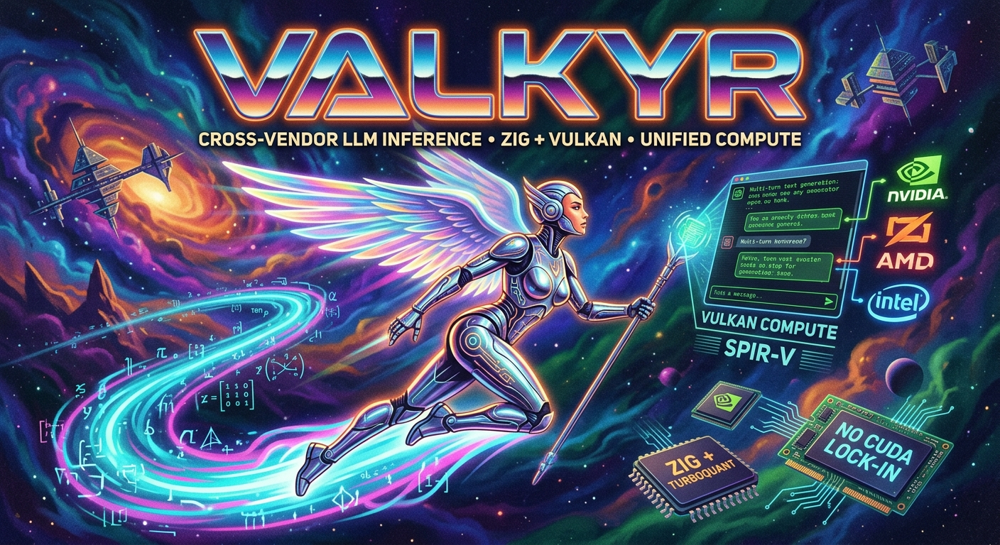

  

# valkyr

**Cross-vendor LLM inference in pure Zig + Vulkan. One SPIR-V binary
runs on every GPU — no CUDA lock-in.**

Greedy and sampled text generation across six model families,
multi-turn chat, parity-verified against HuggingFace `transformers`,
OpenAI-compatible HTTP server, embeddable inside any Vulkan host.
Supported families: Gemma, Llama, Mistral, Qwen3 (dense), Qwen3.5 /
Qwen3.6 (hybrid Gated DeltaNet), TinyLlama / Zephyr.

valkyr runs the same math on any GPU that supports Vulkan 1.3
(AMD / Intel / NVIDIA / Apple via MoltenVK / Android Adreno / Mali) —
one SPIR-V binary, every vendor, no per-backend kernel duplication.
Includes
[TurboQuant](https://research.google/blog/turboquant-redefining-ai-efficiency-with-extreme-compression/)
TQ4 KV-cache compression as `--tq4v`; we believe this is the first
publicly-demonstrable TurboQuant inference on a non-CUDA backend.

## Why valkyr?

valkyr is small (the matmul shader fits on a screen), young (months not
years), and intentionally *less* than llama.cpp. So why pick it up?

- **One backend, every GPU.** A single Vulkan/SPIR-V kernel set runs on
  NVIDIA, AMD, Intel Arc, Apple Silicon (via MoltenVK), and Android
  Adreno / Mali. llama.cpp has separate CUDA / ROCm / Metal / Vulkan /
  SYCL backends; each has its own kernel set, its own quirks, and its
  own performance ceiling. If your hardware mix is heterogeneous, or
  you don't want to bet on CUDA being on every machine forever, the
  one-Vulkan-binary story matters.

- **Embeds inside your render loop.** valkyr ships a public Zig
  module (`valkyr_gpu`) for cooperative-compute integration: attach
  to your existing `VkDevice` / queue / command pool, submit a chat
  command to an `InferenceRunner`, drain token events from
  `pollEvent` once per frame from your aiDispatch hook. The state
  machine spreads forward passes across frames within a configurable
  layer or microsecond budget — silky-smooth inference that runs
  alongside your render passes on the same queue, in the same submit,
  with no parallel CUDA runtime, no shared-memory split, no extra
  GB of dynamic libraries. Works across all six supported families —
  Gemma, Llama, Mistral, Qwen3 (dense), Qwen3.5 / Qwen3.6 (hybrid
  Gated DeltaNet) — with chat templates auto-applied per family
  (Qwen3.5 emits its `<think>` reasoning preamble in-render). Token
  streaming, real-time tensor visualization (an `on_layer` hook
  gives shaders direct access to attention scores), and bespoke
  per-step orchestration are all first-class. See
  [docs/embedding.md](docs/embedding.md). **The natural fit if you
  want inference inside an app that already has a Vulkan graphics
  stack.**

- **OpenAI-compatible server out of the box.** `valkyr --serve <model>`
  runs `/v1/chat/completions` (streaming + non-streaming) and
  `/v1/models`, validated against the official `openai` Python
  client. The HTTP layer is a thin adapter over the same
  `InferenceRunner` the embed path uses — so anything that posts
  to chat-completions (LangChain, Cline, Aider, …) Just Works.
  See [docs/server.md](docs/server.md).

- **Pedagogically transparent.** Every GPU shader has a CPU reference
  in `src/cpu/*.zig` that gets parity-checked against. The full
  inference path is a few thousand lines of Zig you can read top to
  bottom — no decades of accretion to navigate. If you want to
  *understand* what a transformer kernel is doing, or modify one for
  research, this is a friendlier surface.

- **Zero lock-in, zero Python.** One Zig binary, no torch, no
  llama.cpp build system, no GGUF dependency for the basic path (we
  read safetensors + repack at upload time). `zig build` cross-compiles
  to most targets without extra toolchain. Drop into an embedded
  device, a CI runner, or a single static binary deployment without
  dragging a Python stack.

- **Modern architectures, built clean.** Qwen3.5 hybrid (Gated
  DeltaNet + full-attention), TurboQuant Q4 KV cache, llama.cpp-
  compatible Q4_0 and Q4_K_M weights — all built fresh from CPU
  references, not bolted onto an older core. The architectural
  diversity stays legible because nothing's grandfathered.

- **Training is on the menu.** The plan is an Unsloth-class training
  port on top of the same Vulkan kernels — paired forward/backward
  primitives, parity-checked against CPU references. Not yet shipped
  (see roadmap), but the architecture is built for it.

**Honest framing.** valkyr is younger and smaller than llama.cpp. On
raw decode tok/s on a single CUDA card, llama.cpp's CUDA path is
faster than ours today (~1.5× on Qwen3.6 27B with `--q4k` last we
measured). What valkyr offers is **reach** (every Vulkan GPU),
**cleanliness** (CPU oracles for every kernel), and **composability**
(lives inside your existing Vulkan app). If you need maximum
throughput on a single NVIDIA box, llama.cpp is the right tool. If you
want one inference engine that runs everywhere your game or app
already runs, valkyr is.

## Documentation

The detail lives in `docs/`. Each page is self-contained.

| | |
|---|---|
| [docs/quickstart.md](docs/quickstart.md) | Build deps + every CLI mode (`--list`, `--inspect`, `--gen`, `--gpu-gen`, `--chat`, `--bench`, `--serve`, headless validators). |
| [docs/models.md](docs/models.md) | The six supported model families end-to-end and the rest of "what works today" (forward pass, chat, weight precisions, sampling, tokenizer). |
| [docs/quantization.md](docs/quantization.md) | TurboQuant TQ4 V-cache (`--tq4v`), Q4_0 (`--q4`), Q4_K_M (`--q4k`) — algorithmic rationale + try-it. |
| [docs/parity.md](docs/parity.md) | Four-tier parity (HF → CPU → GPU → GPU+TQ4) with the Qwen3 / Qwen3.5 numerical-drift figures + greedy-determinism note. |
| [docs/probes.md](docs/probes.md) | Optional `--probe` JSONL hooks at six points per token; v0 ships activation entropy and logit-entropy + null-prior KL. |
| [docs/perf.md](docs/perf.md) | Decode tok/s table on RTX 3090 across the model + precision matrix, plus the bf16 vectorized-read win and what `--tq4v` is (and isn't) for. |
| [docs/hardware.md](docs/hardware.md) | Vulkan 1.3 GPU requirements + what fits on 24 GiB across the matrix. |
| [docs/architecture.md](docs/architecture.md) | `src/` and `shaders/` layout + convention notes (RoPE pair convention, Gemma quirks, TurboQuant Algorithm 1, numerical drift). |
| [docs/embedding.md](docs/embedding.md) | Full guide for embedding valkyr in a Vulkan host — three integration tiers, frame-budget mechanics, lifetime rules. |
| [docs/server.md](docs/server.md) | OpenAI-compatible HTTP server (`--serve`) — endpoints, streaming, multi-turn, error envelope, openai-python compatibility. |
| [docs/limitations.md](docs/limitations.md) | What valkyr can't do today + experiments that got reverted (tiled-N matmul, Q4_0 split layout, SwiGLU sparsity skipping). |
| [docs/roadmap.md](docs/roadmap.md) | The two big arcs ahead — breadth (more families) + depth (TQ3, fused attention, GPU-side quantize, training port). |

## Embedding in a Vulkan host

valkyr ships a public Zig module (`valkyr_gpu`) for hosts that want
LLM inference inside their own real-time Vulkan stack — game engines,
AR/VR runtimes, embedded apps with a graphics frame loop. The
contract is **cooperative**: valkyr attaches to the host's existing
`VkDevice` / queue / command pool, records its forward-pass dispatches
into the host's per-frame command buffer, and yields back inside a
configurable layer or microsecond budget. At 60 fps the model thinks
across multiple frames cooperatively while the renderer keeps drawing.

**Three integration tiers** — pick the highest one that does what
you need:

- **InferenceRunner** — the queue-based scheduler that wraps Session
  with a request/event protocol. Submit a `Command.chat` with a
  `messages` array; drain `Event`s with `pollEvent`. **Same Runner
  powers `valkyr --serve`** (the OpenAI-compatible HTTP path) — embed
  and HTTP eat from one inference abstraction. Inline mode ticks
  from the host's render loop; threaded mode owns its own worker.
  This is the recommended entry point for engine hosts.
- **Session API** — hand valkyr a model + a prompt and call
  `tickFrame(rec)` once per frame. Bypasses the Runner's queue layer
  for hosts that want token-level orchestration. `Session.init` picks
  dense or hybrid backend automatically (Gemma / Llama / Mistral /
  Qwen3 dense, Qwen3.5 / Qwen3.6 hybrid Gated DeltaNet). Multi-turn
  chat templates threaded through `appendMessages([]const Message)`.
- **Cooperative-compute primitives** — `Context.attach` +
  `Recorder.attachCmd` + `runtime.recordOneLayer` for hosts that
  want to drive the per-step graph themselves (custom samplers,
  multi-NPC scheduling, non-LM forward shapes).

A worked example lives in
[Matryoshka](https://github.com/foundation42/matryoshka)'s `ai_demo`
Game: Gemma 2B IT generating chat-templated text token-by-token
inside the renderer's `drawFrame` via `InferenceRunner.tickWork`,
with the model's last-layer attention driving 16 point lights
through the `on_layer` hook — all sharing one `VkDevice`, one queue,
one submit per frame. Switch the model to Qwen3.5 hybrid and the
same code emits the model's `<think>` reasoning preamble in-render.

For headless verification before wiring a model into a host, valkyr
ships `--session-smoke`, `--session-messages`, `--runner-smoke`,
and `--runner-smoke-threaded` — same code paths as `ai_demo` minus
the GUI. All four supported families (Gemma 2B IT, Llama 3.2
1B-Instruct, Qwen3 4B dense, Qwen3.5 0.8B hybrid) produce
bit-identical text across all of them.

For the full integration guide — build setup, code examples for all
three tiers, frame-budget mechanics, sampling readback strategy,
lifetime rules, and known limitations — see
**[docs/embedding.md](docs/embedding.md)**. For the OpenAI HTTP
path see **[docs/server.md](docs/server.md)**.

## Acknowledgements

This was a real team effort:

- **Christian Beaumont** — [chris@foundation42.org](mailto:chris@foundation42.org),
  founder of [Entrained.ai](https://entrained.ai) and
  [Foundation42](https://foundation42.org). Architect, partner, and
  the patient hand on the rudder. The "one chunk at a time, commit
  between, parity-verify before moving on" rhythm that produced this
  codebase is Christian's, and so is the call that "going fast is
  nice, but correctness is something we need to be very conscious of"
  — which is what put four-tier HF ↔ CPU ↔ GPU ↔ GPU+TQ parity in
  the way of any algorithm shipping.

- **[Anthropic Claude](https://claude.ai)** — implementation partner
  across the marathon sessions. Wrote most of the Zig and GLSL,
  authored the parity tests, and got to celebrate the wins alongside
  Christian.

And the wider community:

- **Andrej Karpathy** for `llama2.c` and the lectures that gave us a
  starting point for the transformer math.
- **Carlo Valenti** for [TRiP](https://github.com/carlovalenti/TRiP)
  (Transformers in Progress), an early CPU reference that helped seed
  the project's pedagogical spirit. valkyr has long since grown into
  its own architecture (Vulkan compute, six families, hybrid backends,
  embed surface, OpenAI server), but the early enthusiasm Carlo
  brought to the port was a real boost.
- **Google** for Gemma; **HuggingFace** for the `transformers` and
  `tokenizers` libraries used as the parity oracle.
- **Amir Zandieh** and the TurboQuant authors at Google Research for
  the algorithm, and **arclabs001** for the YATQ Python reference that
  served as our bit-exact parity oracle. The llama.cpp community
  (TheTom, jesusmb1995, jagsan-cyber, spiritbuun, Madreag,
  Aaryan-Kapoor, scos-lab and others) for prior art on the
  practitioner-side of TurboQuant — their hard-won decisions about
  RHT vs random rotation, dropping QJL, and the norm-correction trick
  shaped every algorithmic call we made.

## License

valkyr is **dual-licensed**:

- **[Apache 2.0](LICENSE-APACHE)** — open-source default. Permissive,
  patent grant included. The right pick for almost everyone.
- **[Commercial](LICENSE-COMMERCIAL.md)** — for organizations that
  want indemnification, SLA / support, no-attribution embedding,
  or custom terms. Contact
  [chris@foundation42.org](mailto:chris@foundation42.org).

Both licenses cover the same code — no "open core" split. See
[LICENSE](LICENSE) for the overview. The transformer math in this
repo is prior art (Vaswani et al. 2017, Karpathy's `llama2.c`, the
open `transformers` reference, published descriptions of RoPE /
RMSNorm / GeGLU / SwiGLU / GQA / Gated DeltaNet / TurboQuant / RHT);
the Zig + Vulkan implementation is original.
